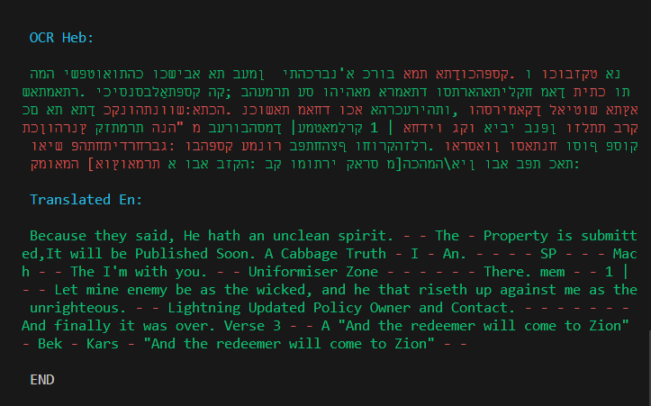

# Read text from an image and translate it into another language
--------------------------------

Run with:
 
<code>python ./ocr_test.py</code>

## Example
###### Input

Hebrew Bible with David Kimhi's Sefer Mikhlol ('Kennicott Bible'), 1476

<strong>Source:</strong> https://digital.bodleian.ox.ac.uk/objects/8c264b23-f6cc-4f18-98cf-9d75f7175b54/surfaces/af9aa4ac-8c92-46f0-90bf-774d2b56d160/#

###### Output

--

<a href="https://en.wikipedia.org/wiki/Optical_character_recognition">OCR (Optical Character Recognition)</a> is performed with <a href="https://pypi.org/project/pytesseract/">pytesseract</a>

Translation is preformed with <a href="https://pypi.org/project/translate/">translate</a>

