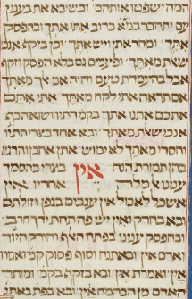

# Translate text from an image and translate it into another language
--------------------------------

Run with:
 
<code>python ./ocr_test.py</code>

## Input
-------------------------------------------------
Hebrew Bible with David Kimhi's Sefer Mikhlol ('Kennicott Bible'), 1476

<strong>Source:</strong> https://digital.bodleian.ox.ac.uk/objects/8c264b23-f6cc-4f18-98cf-9d75f7175b54/surfaces/af9aa4ac-8c92-46f0-90bf-774d2b56d160/#

Output
------------------------------------------

--

OCR is performed with pytesseract:
Project description from pypi.org:
Python-tesseract is an optical character recognition (OCR) tool for python. That is, it will recognize and “read” the text embedded in images.

Python-tesseract is a wrapper for Google’s Tesseract-OCR Engine. It is also useful as a stand-alone invocation script to tesseract, as it can read all image types supported by the Pillow and Leptonica imaging libraries, including jpeg, png, gif, bmp, tiff, and others. Additionally, if used as a script, Python-tesseract will print the recognized text instead of writing it to a file.
